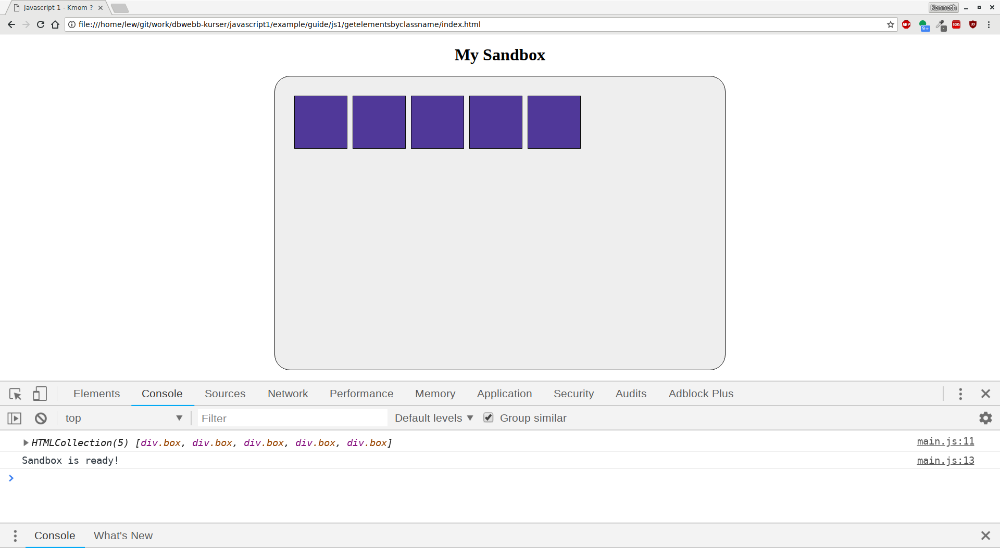

Hämta element
==================================

### Hämta via id

Vi vet att man kan sätta ett `id` på html-elementen, till exempel `<div id="content">`. Vi bör inte använda id för att styla elementen men om man ska hämta ut det via JavaScript går det bra. Ett id får bara tillhöra ett element och ska vara unikt för sidan. Det gör att vi enbart hämtar just det elementet.

Vi behöver en sida som har definierat ett elements id-attribut. Utgångsläget kommer vara sandboxen som du hittar i [exempelmappen](https://github.com/dbwebb-se/js-v2/tree/master/example/sandbox). 

Raden i sandbox/index.html vi ska fokusera på är:

```html
<div id="content" class="content">
```

Där har vi satt ett id på elementet, bra. Då är det bara att tuta på!


#### JavaScript-filen

Då JavaScript-filen har länkats in via `js/main.js` kan vi nå vår div därifrån:

```js
let myContent = document.getElementById('content')

myContent.innerHTML = '<h3>This is a template!</h3>'
```

Vi kan se att elementet hämtas via `document` som är själva huvudsidan. Allting kan nås därifrån. Nu har vi div-objektet i variabeln `myContent` och kan styra och ställa med den. Med innerHTML kan vi bestämma hur den "inre html-koden" ska vara i just det elementet. Här skriver vi ut "This is a temlpate!" inuti en `<h3>`-tagg.


#### console.log

Ett tips är att använda `consolen`, som du hittar via webbläsaren och `F12`, alternativt högerklicka och välja "Inspect" eller liknande. Vi lägger till raden:

```js
console.log(myContent)
```

Om du nu kikar i consolen kan du se hela elementet som vi har fångat:


### Hämta via klassnamn

Om vi hämtar element via klassnamn får vi alla element som har det efterfrågade klassnamnet. Funktionen returnerar en *live HTMLCollection*. Det betyder att den representerar elementen i realtid och om vi ändrar på elementen kommer vi även ändra de hämtade objekten. Ofta spelar det ingen roll, men det är bra att känna till när vi itererar igenom elementen.

Vi behöver loopa igenom den eller peka på elementen i arrayen specifikt.


#### html- och cssfilerna

```html
<div id="content" class="content">
    <div class="box"></div>
    <div class="box"></div>
    <div class="box"></div>
    <div class="box"></div>
    <div class="box"></div>
</div>
```

Vi behöver lägga följande i css filen:

```css
.box {
    width: 75px;
    height: 75px;
    display: inline-block;
}
```


#### JavaScript-filen

```js
const boxes = document.getElementsByClassName("box");

for (let i = 0; i < boxes.length; i++) {
    boxes[i].style.backgroundColor = "#503899"
    boxes[i].style.margin = "5px"
}

console.log(boxes)
```

En HTMLCollection har egenskapen `length` så vi kan loopa igenom den och nå alla element. Via `.style` kan vi ändra på elementens css.


#### Resultat

Om du nu kikar i consolen kan du se att vi har fem objekt i typen `HTMLCollection`.




### Hämta via querySelector

Som ett alternativ till att hämta element med klassnamn kan vi använda och `querySelectorAll()`. Där returneras en statisk nodelista där alla element med den valda *css selectorn* finns. Om vi tar ovan exempel igen men hämtar med querySelectorAll istället behöver vi bara ändra raden som hämtar elementen: `const boxes = document.querySelectorAll(".box")`.

Man kan även välja att enbart hämta det första element som matchar med `querySelector(selector)`.


### Hämta via taggnamn

Att hämta via tagg-namn fungerar likadant som med klassnamn. Funktionen ser ut på följande sätt:

```js
let boxes = document.getElementsByTagName("div")
```
